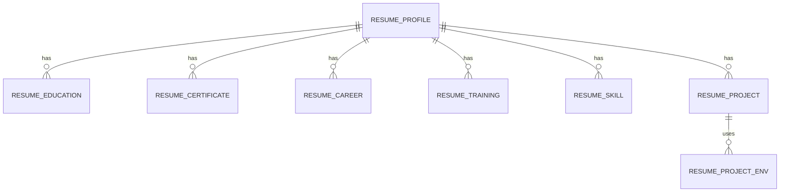

# 이력서 Oracle 데이터베이스 설계

상위 폴더의 `이력서.docx`에 있는 개인 이력 카드와 SKILL INVENTORY를 8개 테이블로 구성했다. 기본정보를 중심으로 학력·자격증·경력·교육·기술·프로젝트를 분리하고, 프로젝트 개발환경의 복수 값은 별도 행으로 저장한다. SQL 파일을 생성한 상태이며 실제 Oracle 데이터베이스에는 실행하지 않았다.

## 파일 및 실행 방법

| 파일 | 내용 |
| --- | --- |
| `schema_oracle.sql` | 테이블, 자동 생성 PK, FK, UNIQUE/CHECK 제약조건, 한글 설명 |
| `seed_resume.sql` | 원문에 입력된 내용 18행 적재, 성공 시 COMMIT, 실패 시 ROLLBACK |
| `verify_resume.sql` | 테이블별 기대 건수 비교 및 프로젝트 조회 |

Oracle 19c를 기준으로 작성했으며 IDENTITY 구문을 사용하므로 최소 Oracle 12c 이상을 전제로 한다. Oracle 11g에는 시퀀스와 트리거 방식으로 변경해야 한다. 한글 저장을 위해 AL32UTF8 데이터베이스 문자 집합과 UTF-8 클라이언트 설정을 권장한다. 파일은 UTF-8이다.

기존 Oracle 사용자로 접속한 SQL*Plus/SQLcl에서 해당 폴더를 기준으로 아래 순서대로 실행한다. SQL Developer에서는 스크립트 실행(F5)을 사용한다. 접속 사용자는 CREATE TABLE 권한과 대상 테이블스페이스 할당량이 필요하다. 사용자·테이블스페이스 생성과 권한 부여는 포함하지 않는다.

```sql
@schema_oracle.sql
@seed_resume.sql
@verify_resume.sql
```

객체가 없는 대상 스키마에 최초 1회 실행하는 용도다. DDL 재실행은 기존 객체 오류가 발생하고, 적재 스크립트 재실행은 새로운 이력서를 추가하므로 중복 데이터가 생긴다. DDL은 Oracle의 암묵적 COMMIT 대상이어서 중간 오류 발생 시 이미 생성된 객체가 남는다. 적재는 별도 세션 또는 미완료 트랜잭션이 없는 세션에서 실행한다.

## 테이블 요약

| 테이블 | 원문 항목 및 주요 컬럼 | 적재 건수 |
| --- | --- | ---: |
| `RESUME_PROFILE` | 성명, 생년월일, 성별, 소속회사, 입사일, 부서, 직위, 병적, 전화, 이메일, 주소, 기타 기술, 작성자 | 1 |
| `RESUME_EDUCATION` | 학교명, 계열·전공, 입학일, 졸업일, 졸업 상태 | 2 |
| `RESUME_CERTIFICATE` | 자격증명, 취득일 | 0 |
| `RESUME_CAREER` | 회사명, 시작·종료일, 재직 여부, 직위, 담당업무 | 3 |
| `RESUME_TRAINING` | 교육명, 시작·종료일, 교육기관 | 0 |
| `RESUME_SKILL` | 기술·외국어명, 숙련도 A/B/C | 3 |
| `RESUME_PROJECT` | 프로젝트명, 참여일자, 고객사, 근무회사, 역할, 수행업무 | 3 |
| `RESUME_PROJECT_ENV` | 개발환경 구분 및 개별 값: 기종, OS, 언어, DBMS, TOOL, 통신, WAS | 6 |
| 합계 | 실제 내용이 있는 행만 적재 | 18 |

## 관계 및 제약조건



- 이력서 단위의 기본정보 1행과 반복 이력의 1:N 구조다. 동일인의 여러 이력서 버전은 별개 RESUME_ID로 저장하며, 인물 중복 판단이나 버전 관리는 포함하지 않는다.
- 모든 PK는 `NUMBER GENERATED ALWAYS AS IDENTITY`다. 적재 시 `RETURNING INTO`로 생성된 키를 받아 FK에 사용한다.
- 상세 이력의 `DISPLAY_ORDER`는 문서 내 순서이며 양수다. 이력서별 순서를 UNIQUE로 제한한다. 환경 값은 프로젝트·환경 구분별 순서를 UNIQUE로 제한한다.
- UNIQUE 인덱스의 선두 열이 FK이므로 FK 조회를 위한 중복 인덱스를 추가하지 않았다. 삭제 연쇄 처리는 없으며 자식 행이 있으면 부모 삭제가 제한된다.
- 시작일·종료일이 모두 있으면 종료일은 시작일 이상이어야 한다. 미기재 날짜는 NULL을 허용한다. 재직중(Y)이면 종료일은 NULL이어야 한다. N이면서 종료일 미상인 경우도 허용한다.
- 숙련도는 A/B/C 또는 NULL을 허용한다. 문서에 등급별 설명이 없어 상·중·하 등의 의미는 부여하지 않았다.
- 한글 문자열은 `VARCHAR2(n CHAR)`, 긴 서술은 `CLOB`, 일자는 `DATE`, 적재 시각은 `TIMESTAMP`를 사용한다. 자동 갱신 시각이나 문서 작성일을 추정하지 않는다.

## 원문 변환 기준

- 빈 셀, 전화·이메일의 `-`, 생년월일의 `YYYY-MM-DD`는 NULL로 저장한다. 자격증·교육의 빈 행, 프로젝트의 빈 행, 병합 셀에 따른 공백은 데이터로 생성하지 않는다.
- 원문의 `OOO`, `OOOOO`, `OOOOOO`, `OO대학교`, `XXX공학과` 같은 익명 표기는 그대로 보존한다.
- 경력의 `2024.10.28 ~ 재직중`은 시작일 `2024-10-28`, 종료일 NULL, 재직 여부 Y로 저장한다. 이는 문서 기재 기준이며 현재도 재직중이라고 검증한 것은 아니다.
- 기본정보 소속회사·입사일·직위가 공란이므로 최근 경력으로 임의 보충하지 않는다. 경력의 익명 회사명과 프로젝트의 `소닉스`도 임의로 연결하지 않는다.
- 학력과 자격증, 교육과 보유기술은 같은 표에 나란히 있지만 서로 독립된 목록이다. 같은 행에 있었다는 이유로 관계를 만들지 않는다.
- 프로젝트 기간 머리글은 `yyyy.mm` 형식이지만 실제 값에는 일자가 있어 일 단위 DATE로 보존한다. 날짜 리터럴 `DATE 'YYYY-MM-DD'`를 사용해 NLS_DATE_FORMAT 의존성을 없앴다.
- 프로젝트 TOOL의 `CREO,AutoCAD`는 두 행으로 분리한다. 다른 개발환경은 공란이므로 저장 행을 만들지 않는다. 기타 기술 문구는 `OTHER_SKILLS`에 원문 그대로 보존한다.
- 3단계 프로젝트명의 띄어쓰기는 원문을 유지한다. 문서의 작성자 라벨에는 실제 이름이 없어 AUTHOR_NAME은 NULL이다. 제목, 입력 안내, 장식용 공백은 저장 대상에서 제외한다.

## 검증 범위

원문 OOXML의 표와 텍스트를 읽어 항목 및 적재 값을 대조했다. DDL의 테이블·컬럼 참조, FK, 식별자 길이, INSERT 건수와 날짜를 정적으로 확인했다. Oracle 서버 연결정보와 실행 클라이언트가 제공되지 않아 실제 생성·적재 실행은 검증하지 않았다. `verify_resume.sql`의 건수 비교는 빈 스키마에서 최초 1회 적재한 경우를 기준으로 한다.

구문 참고: [Oracle 19c CREATE TABLE 공식 문서](https://docs.oracle.com/en/database/oracle/oracle-database/19/sqlrf/CREATE-TABLE.html).
