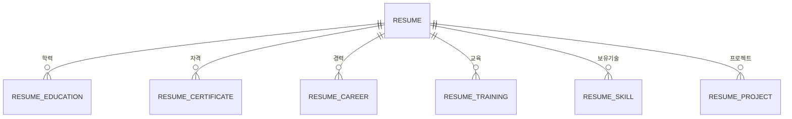

# 개인이력카드 Oracle DDL

`../이력서.docx`(개인이력카드)를 Oracle 테이블로 옮긴 스키마와, 그 문서에 적힌 값을 넣는 적재 스크립트다. 실행 파일은 [`schema.sql`](schema.sql)이다.

대상은 Oracle 12c 이상이다. 기본키는 `GENERATED BY DEFAULT AS IDENTITY`를 쓴다. 문자 길이는 `VARCHAR2(n CHAR)`라서 한글도 문자 수로 센다. 데이터베이스 문자셋은 AL32UTF8을 전제로 한다.

접속한 사용자 스키마에 생성한다. 스크립트는 자식 테이블부터 `DROP`한 뒤 다시 만들므로, 같은 이름의 테이블이 있으면 데이터까지 지워지고 이 문서 내용으로 다시 채워진다.

```text
sqlplus user/password @schema.sql
```

## 문서와 테이블

카드 한 장이 `RESUME` 한 행이다. 반복 구간은 이력 행을 가리키는 자식 테이블이다. 한 표 안에 나란히 있는 학력/자격, 교육/보유기술은 서로 다른 엔터티라 테이블을 나눴다. 양식의 빈 열(구분용 칸)은 컬럼으로 만들지 않았다.



자식 외래키는 `ON DELETE CASCADE`다. 이력 행을 지우면 학력·자격·경력·교육·기술·프로젝트가 함께 지워진다. Oracle은 외래키 컬럼에 인덱스를 자동으로 만들지 않아서, 각 `RESUME_ID`에 인덱스를 둔다.

| 테이블 | 양식 구간 | 이 문서의 행 수 |
| --- | --- | --- |
| `RESUME` | 성명, 연락처, 소속, 기타 | 1 |
| `RESUME_EDUCATION` | 학력사항 | 2 |
| `RESUME_CERTIFICATE` | 자격증명, 취득일 | 0 |
| `RESUME_CAREER` | 회사명, 기간, 직위, 담당업무 | 3 |
| `RESUME_TRAINING` | 교육명, 시작일, 종료일, 기관 | 0 |
| `RESUME_SKILL` | 보유기술 및 외국어능력, 숙련도 | 3 |
| `RESUME_PROJECT` | SKILL INVENTORY | 3 |

자격증과 교육은 양식에 열이 있고 이 파일에는 값이 없다. 테이블은 만들고 `INSERT`는 하지 않는다.

## 컬럼

공통으로 `SORT_ORDER`는 문서에 나온 순서다. 1부터 시작한다. 프로젝트 양식은 최근 건을 아래에 쓰라고 되어 있어, `SORT_ORDER`가 그 순서를 그대로 따른다.

### RESUME

| 컬럼 | 타입 | 양식 |
| --- | --- | --- |
| `RESUME_ID` | NUMBER IDENTITY | PK |
| `FULL_NAME` | VARCHAR2(50 CHAR) NOT NULL | 성명 |
| `BIRTH_DATE` | DATE | 생년월일 |
| `GENDER` | VARCHAR2(10 CHAR) | 성별 |
| `COMPANY_NAME` | VARCHAR2(100 CHAR) | 소속회사 |
| `HIRE_DATE` | DATE | 입사일자 |
| `DEPARTMENT` | VARCHAR2(100 CHAR) | 부서 |
| `POSITION` | VARCHAR2(50 CHAR) | 직위 |
| `MILITARY_STATUS` | VARCHAR2(50 CHAR) | 병적 |
| `PHONE` | VARCHAR2(30 CHAR) | 전화 |
| `EMAIL` | VARCHAR2(200 CHAR) | E-Mail |
| `ADDRESS` | VARCHAR2(300 CHAR) | 주소 |
| `OTHER_SKILL_NOTE` | VARCHAR2(500 CHAR) | 기타 (활용가능한 S/W 및 기법, FrameWork) |

### RESUME_EDUCATION

학교명, 전공/계열, 입학일(`START_DATE`), 졸업일(`END_DATE`), 졸업구분. 양식은 대학(교, 원) 입학일 표기를 요구한다. `END_DATE`가 있으면 `START_DATE`보다 빠를 수 없다.

### RESUME_CERTIFICATE

자격증명(`CERTIFICATE_NAME`), 취득일(`ACQUIRED_DATE`).

### RESUME_CAREER

회사명, 기간 시작/종료, 직위, 담당업무. `IS_CURRENT`는 재직중이면 1, 아니면 0이고 기본값은 0이다. 재직중이면 `END_DATE`는 NULL이어야 한다.

### RESUME_TRAINING

교육명, 시작일, 종료일, 기관. 종료일이 시작일보다 빠를 수 없다.

### RESUME_SKILL

보유기술 및 외국어(`SKILL_NAME`), 숙련도(`PROFICIENCY`). 숙련도는 `A`, `B`, `C` 또는 NULL만 허용한다.

### RESUME_PROJECT

프로젝트명, 참여기간, 고객사, 근무회사, 역할, 수행업무. 개발환경은 양식의 일곱 칸을 각각 컬럼으로 둔다.

| 컬럼 | 양식 |
| --- | --- |
| `HW_MODEL` | 기종 |
| `OS_NAME` | OS |
| `LANGUAGE_NAME` | 언어 |
| `DBMS_NAME` | DBMS |
| `TOOL_NAME` | TOOL |
| `COMMUNICATION` | 통신 |
| `WAS_NAME` | WAS |

## 적재 규칙

| 문서에 적힌 값 | 저장 |
| --- | --- |
| 빈 칸 | NULL |
| 전화, E-Mail의 `-` | NULL |
| 생년월일 `YYYY-MM-DD` (자리표시) | NULL |
| `2019.04.01 ~ 2023.07.31` | `START_DATE`, `END_DATE` |
| `2024.10.28 ~ 재직중` | 종료일 NULL, `IS_CURRENT = 1` |
| 셀 안의 줄바꿈 (`CREO,` / `AutoCAD`) | 한 줄 `CREO, AutoCAD` |

이 카드에서 채워진 값은 다음과 같다.

- 성명 홍길동, 주소 경기도 화성시
- 학력 2건: OOO고등학교(인문계 이과, 2008-03-03 ~ 2011-02-09, 졸업), OO대학교(XXX공학과, 2011-03-02 ~ 2017-08-22, 졸업)
- 경력 3건: OOO 대리, OOOOO 선임, OOOOOO 선임(재직중, 공정물류 기구설계)
- 보유기술: AutoCAD A, CREO B, SolidWorks B
- 프로젝트 3건: LGD 파주공장 애플워치 셀 자동화 검사장비 1~3단계. 고객사 LGD, 근무회사 소닉스, 역할 설계, TOOL은 CREO와 AutoCAD, 수행업무는 CAMERA 파트 설계와 프레임 설계
- 기타: CREO, AutoCAD, SolidWorks

성별, 소속회사, 입사일자, 부서, 직위, 병적, 전화, 이메일, 생년월일은 비어 있다. 프로젝트의 기종, OS, 언어, DBMS, 통신, WAS도 비어 있다.

컬럼 한글 설명은 `COMMENT ON TABLE` / `COMMENT ON COLUMN`으로 딕셔너리에 들어가 있다.

```sql
SELECT table_name, comments
  FROM user_tab_comments
 WHERE table_name LIKE 'RESUME%';

SELECT column_name, comments
  FROM user_col_comments
 WHERE table_name = 'RESUME'
 ORDER BY column_name;
```
