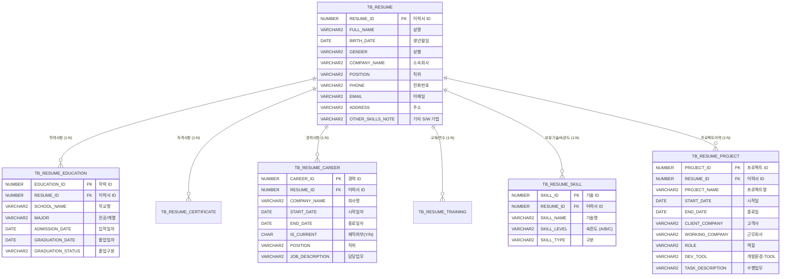

# 이력서(개인이력카드) DB 모델링 및 Oracle DDL 구축 요약

본 프로젝트는 `..\이력서.docx` 워드 문서 내 개인이력카드 및 프로젝트 수행이력(Skill Inventory)의 비정형/반정형 데이터를 관계형 데이터베이스(RDBMS)로 정규화하여 **Oracle DBMS**에 최적화된 DDL 스키마 및 적재 스크립트를 작성한 결과입니다.

---

## 1. 개요 및 설계 원칙

- **대상 파일**: `..\이력서.docx` (개인이력카드, 학력/자격/경력/교육/보유기술, SKILL INVENTORY 프로젝트 이력)
- **대상 DBMS**: **ORACLE Database** (12c, 19c, 21c, 23c+ 완벽 호환)
- **주요 설계 원칙**:
  1. **정규화 및 관계 정의**: 마스터 테이블(`TB_RESUME`)을 중심으로 1:N 관계의 세부 이력(학력, 자격, 경력, 교육, 기술, 프로젝트)으로 분리 설계.
  2. **Oracle 맞춤형 데이터 타입**:
     - 기본키: Oracle 12c 표준 `NUMBER GENERATED BY DEFAULT AS IDENTITY` 사용.
     - 문자열: 한글 UTF-8 인코딩 안전 처리를 위해 Byte 단위가 아닌 `VARCHAR2(n CHAR)` 지정.
     - 날짜: `DATE` 타입 활용 및 `CHECK` 제약조건을 통한 시작일/종료일 정합성 보장.
     - 불리언 플래그: Oracle 표준 방식에 따라 `CHAR(1 CHAR) DEFAULT 'N' CHECK (IS_CURRENT IN ('Y', 'N'))` 구현.
  3. **데이터 무결성 및 인덱스 최적화**:
     - 외래키(`FOREIGN KEY ... ON DELETE CASCADE`) 지정.
     - Oracle의 외래키 잠금(Lock Contention) 방지 및 조회 성능 최적화를 위한 복합 인덱스(`RESUME_ID`, `SORT_ORDER`) 생성.
  4. **메타데이터 사전 구축**: `COMMENT ON TABLE`, `COMMENT ON COLUMN`을 완벽히 기술하여 데이터 딕셔너리 및 ERD 자동화 툴 연동 지원.
  5. **멱등성(Idempotency)**: 반복 실행이 가능하도록 PL/SQL 블록을 통한 안전한 테이블 드롭 구문 포함.

---

## 2. 테이블 구성 및 ERD 구조



---

## 3. 세부 테이블 정의서

### [1] `TB_RESUME` (개인이력카드 기본정보 마스터)
| 컬럼명 | 데이터 타입 | 제약조건 | 설명 | 원본 문서 매핑 |
|---|---|---|---|---|
| `RESUME_ID` | NUMBER | PK, IDENTITY | 이력서 식별번호 | 인적사항 기본 식별자 |
| `FULL_NAME` | VARCHAR2(50 CHAR) | NOT NULL | 성명 | 홍길동 |
| `BIRTH_DATE` | DATE | NULL | 생년월일 | YYYY-MM-DD |
| `GENDER` | VARCHAR2(10 CHAR) | NULL | 성별 | 성별 |
| `COMPANY_NAME` | VARCHAR2(100 CHAR) | NULL | 소속회사 | 소속회사 |
| `HIRE_DATE` | DATE | NULL | 입사일자 | 입사일자 |
| `DEPARTMENT` | VARCHAR2(100 CHAR) | NULL | 부서 | 부서 |
| `POSITION` | VARCHAR2(50 CHAR) | NULL | 직위 | 직위 |
| `MILITARY_STATUS`| VARCHAR2(50 CHAR) | NULL | 병적 구분 | 병적 |
| `PHONE` | VARCHAR2(30 CHAR) | NULL | 전화번호 | 전화 (-) |
| `EMAIL` | VARCHAR2(100 CHAR)| NULL | 이메일 주소 | E - Mail (-) |
| `ADDRESS` | VARCHAR2(300 CHAR)| NULL | 주소 | 경기도 화성시 |
| `OTHER_SKILLS_NOTE`| VARCHAR2(1000 CHAR)| NULL | 기타 활용가능 S/W | CREO, AutoCAD, SolidWorks |
| `CREATED_AT` | DATE | NOT NULL (SYSDATE) | 등록일시 | 시스템 생성 |
| `UPDATED_AT` | DATE | NOT NULL (SYSDATE) | 수정일시 | 시스템 생성 |

### [2] `TB_RESUME_EDUCATION` (학력사항)
- **학교명 / 전공 / 입학일자 / 졸업일자 / 졸업구분 / 표시순서**
- 제약조건: `CHECK (GRADUATION_DATE IS NULL OR GRADUATION_DATE >= ADMISSION_DATE)`
- 원본 매핑:
  - OOO고등학교 / 인문계 이과 / 2008.03.03 ~ 2011.02.09 (졸업)
  - OO대학교 / XXX공학과 / 2011.03.02 ~ 2017.08.22 (졸업)

### [3] `TB_RESUME_CERTIFICATE` (자격사항)
- **자격증명 / 취득일자 / 발급기관 / 표시순서**

### [4] `TB_RESUME_CAREER` (경력사항)
- **회사명 / 시작일 / 종료일 / 재직여부(`IS_CURRENT`) / 직위 / 담당업무 / 표시순서**
- 원본 매핑:
  - OOO / 2019.04.01 ~ 2023.07.31 / 대리 / 기구설계 (CREO, AutoCAD)
  - OOOOO / 2023.08.03 ~ 2024.09.30 / 선임 / 기구설계 (CREO, AutoCAD)
  - OOOOOO / 2024.10.28 ~ 재직중(`IS_CURRENT = 'Y'`) / 선임 / 공정물류 기구설계

### [5] `TB_RESUME_TRAINING` (교육 및 연수사항)
- **교육명 / 시작일자 / 종료일자 / 교육기관 / 표시순서**

### [6] `TB_RESUME_SKILL` (보유기술 및 외국어능력)
- **기술명 / 숙련도(`A/B/C`) / 기술구분 / 표시순서**
- 원본 매핑:
  - AutoCAD: A
  - CREO: B
  - SolidWorks: B

### [7] `TB_RESUME_PROJECT` (SKILL INVENTORY - 프로젝트 수행이력)
- **프로젝트명 / 시작일 / 종료일 / 고객사 / 근무회사 / 역할 / 개발환경(기종, OS, 언어, DBMS, TOOL, 통신, WAS) / 수행업무 / 표시순서**
- 원본 매핑:
  - 1단계: LGD 파주공장 애플워치 셀자동화검사장비 구축 1단계 (2019.09.01 ~ 2019.12.31 / LGD / 소닉스 / 설계 / CREO, AutoCAD / CAMERA 파트 설계, 프레임 설계)
  - 2단계: LGD 파주공장 애플워치 셀자동화검사장비 구축 2단계 (2020.09.01 ~ 2020.12.31 / LGD / 소닉스 / 설계 / CREO, AutoCAD / CAMERA 파트 설계, 프레임 설계)
  - 3단계: LGD 파주공장 애플워치 셀 자동화 검사장비 구축 3단계 (2021.09.01 ~ 2021.12.31 / LGD / 소닉스 / 설계 / CREO, AutoCAD / CAMERA 파트 설계, 프레임 설계)

---

## 4. 실행 및 검증 안내

작성된 Oracle 스크립트 파일: [`schema.sql`](schema.sql)

### 실행 방법 (SQL*Plus, SQLcl, 또는 DBeaver/SQL Developer)
```sql
-- SQL*Plus 또는 SQLcl 환경에서 실행 시
@schema.sql
```

### 통합 조회 뷰 (`VW_RESUME_OVERVIEW`)
```sql
SELECT * FROM VW_RESUME_OVERVIEW;
```
스크립트 실행 완료 시 개인이력카드 원본의 인적사항, 학력(2건), 경력(3건), 스킬(3건), 프로젝트 수행이력(3건)이 즉시 적재되어 조회 가능합니다.
